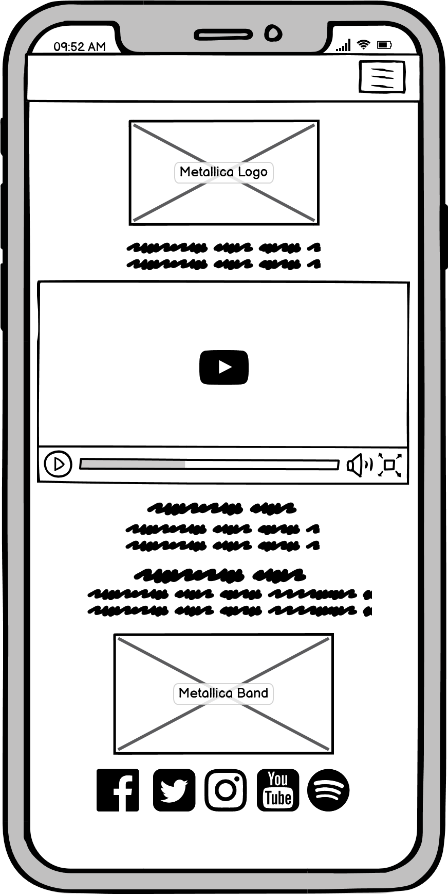

# Metallica Website

I have created this website to be used as a forum for information on Metallica. It is for any fan old or new to come and learn about the band and find out about future gigs to go to.

# Table of Contents
- [1. UX](#1.-ux)
- [1.1. Strategy](#1.1.-strategy)
- [1.2. Scope](#1.2.-scope)
- [1.3. Structure](#1.3.-structure)
- [1.4. Skeleton](#1.4.-skeleton)
- [1.5. Surface](#1.5.-surface)
- [2. Features](#2.-features)
- [3. Technologies Used](#3.-technologies-used)
- [4. Testing](#4.-testing)
- [5. Deployment](#5.-deployment)
- [6. Final Product](#6.-final-product)
- [7. Known Bugs](#7.-known-bugs)
- [8. Credits](#8.-credits)

My website link - https://richardlatham97.github.io/MS1-Metallica/index.html

Here is my home page on all devices using Am I Responsive

## 1. UX

[Go to the top](#table-of-contents)

This website is an information centre for metallica fans across the world wishing to learn more about the band. Who they are, when they were formed and their current activity including tour date info.

## 1.1. Strategy

[Go to the top](#table-of-contents)

User Goals:

To inform the target audience just who Metallica are and what they do as a band.
The user will expect easy to access information on a website that isn't intimidating, the band is 40 years old this year, so it has a wide range of fans of all ages that consume information differently and this must be remembered in its design.

User Expectations:
* A clean website design for ease of access.
* All buttons and elements are responsive.
* The design fits the asthetic of the band and its target audience.
* Be engaging to keep the user intersted in what they are reading.
* Include a way to stay informed about the website in the form of a sign-up page.

## 1.2. Scope
[Go to the top](#table-of-contents)

The website development will be split into different phases. Phase 1 is a realistic expectation of what can be developed. Phase 2 is a future development plan with some ideas on new features to be implimented.

### Phase 1:

* Responsive design including mobile compatability
* Historical and current band information
* Tour dates/events
* Responsive navbar

### Phase 2:

* Interactive events page with an option to go to a bookings page affiliated with the tour dates
* Metallica fan merchandise page

## 1.3. Structure

[Go to the top](#table-of-contents)

This website must adhere to the current standards of responsive design including compatability with tablet and mobile phones due to the increased use of these devices.

I have ensured that:

* All web pages are responsive to all screen sizes
* Images react well to screen sizes avoiding stretched/pixelated images
* The navbar has a button function available for smaller screens
* Social media Icons are not too large or too small on mobile devices, they all fit well.
* Font sizes are appropriate for both desktop and smaller devices making text legible for everyone.

## 1.4. Skeleton

[Go to the top](#table-of-contents)

I created the wireframes using Balsamiq which are below.

### Metallica Home Page (index.html)

### Metallica Home Page Mobile

### Metallica Events Page 

### Metallica Events Page Mobile

### Metallica Gallery Page 

### Metallica Gallery Page Mobile

### Metallica Sign Us Page

### Metallica Sign Us Page Mobile

## 1.5. Surface

[Go to the top](#table-of-contents)

### Color Scheme

Colours used were Black and White as I felt that this was the right asthetic for a band like Metallica. The sign up form is the only acception and uses the colour #4f4f4f which is a light grey to contrast a little with the background but doesn't look out of place.

### Typography

I used the "Oswald" font from https://fonts.google.com/ as it is bold, legible and fits with the asthetic of Metallica.

## 2. Features

[Go to the top](#table-of-contents)

The website will consist of four seperate web pages. The website will be mainly styled using bootstrap 4. Here I will list the features used in 

## All pages
* A navbar that spans across the top of the page with links to all websites, a "hover" feature and also an "active" feature to show the user where they are on the website. (styled using bootstrap 4) 
* "Metallica" in the top left of the navbar to show this is a website about metallica.
* Social media links in the form of icons using https://fontawesome.com/

## Home
* A Metallica logo at the top of the page with the words "WELCOME TO METALLICA'S GREATEST FAN PAGE!" to clarify that this is a fan page about the band and not their own website.
* A youtube video is embedded in the page below the logo to visually show the band and one of their biggest hits "For Whom The Bell Tolls" played for BlizzCon 2021.
* Text about the page headed "About Us".
* Text with brief information about the band headed "The Men, the Myths and the Legends".
* A picture of the band with it's current members using custom css for the border and curved edges.

## Events
* A banner image accross the top of a gig to symoblise that the user is on the Events page.
* A heading below the image saying "Tour Dates"
* A table with the tour dates and location for the user to figure out when the band is playing next.

## Gallery
* A heading saying "Our Gallery"
* Various pictures of the band assorted using bootstrap and styled in css to give the white border and curved edges 

## Sign Up
* Text saying "WELCOME TO OUR SIGN UP PAGE! PLEASE USE THE SIGN UP FORM BELOW TO BECOME A METALLICA FAN PAGE MEMBER AND GET EXCLUSIVE BAND NEWS THROUGH OUR MAILING LIST!"
* A working form styled using custom css, when the entire form is filled out and "Submit" is clicked, the form will send the user to the Code Institute formdump site to confirm that the form works and all criteria is met.

## 3. Technologies Used
[Go to the top](#table-of-contents)

* HTML5 - HyperText Markup Language 5 used to build the website.
* CSS3 - Cascading Style Sheets 3 used to style some of the website.
* Bootstrap 4.1.3 - Used to create a base style for some of the website.
* Google Fonts - Used to source the font used across the website
* Font Awesome - Used to source the social media icons.
* Google Chrome Dev Tools - To test my code and check responsiveness.
* Balsamic - To create the wireframes for my website.
* W3C HTML validator - To validate HTML5 code.
* W3C CSS validator - To validate CSS3 code.

## 4. Testing

[Go to the top](#table-of-contents)

## Testing Via Software

### Google Development Tools

I used this as a virtual testbed to see how responsive my website was and to inspect any code and fiddle around to see what works and what doesn't.

### W3c Validatior Tools

W3c markup was used to test each page to see if there are any errors in the code

### Home (index.html)
* One error came up to higlight: Section lacks heading. Consider using h2-h6 elements to add identifying headings to all sections.

### Events (events.html)

* No errors were highlighted

### Gallery (gallery.html)

* Multiple errors came up to highlight a duplicate error with an ID tag for #photos, this was rectified by changing the ID to a class to style this particular element.

### Sign Up (sign-up.html)

* Once again a duplicate error came up for the password ID, this was changed to repeat-passoword for the repeat password label on the sign up form.

### W3c CSS

* All pages checked, no errors shown.

## Testing using devices

[Go to the top](#table-of-contents)

The website was tested on a few different devices and also tested on safari and google chrome to make sure it loaded correctly.

### Devices used to test:

* iPhone XS Max
* iPhone 8 Plus
* iPhone 7
* Asus TUF Gaming 15" Laptop

## My testing process in order of page on all devices:

### All Pages

#### Navbar 

* "Home" link works as expected when clicked/tapped depending on device, taking you to the Home page.
* "Events" link works as expected when clicked/tapped depending on device taking you to the Events page.
* "Gallery" link works as expected when clicked/tapped depending on devicetaking you to the Gallery page.
* "Sign Up" link works as expected when clicked/tapped depending on device taking you to the Sign Up page.
* "Metallica" link works as expected when clicked/tapped depending on device taking you to the Home page.
* All links also refreshes the page if you are already on it.

#### Social Media links

* Facebook icon takes you to the Metallica facebook page in a new tab as expected. If on mobile it will take you to the twitter app (if installed).
* Twitter icon takes you to the Metallica twitter page in a new tab as expected. If on mobilen it will take you to the twitter app (if installed).
* Instagram icon takes you to the Metallica Instagram page in a new tab as expected. If on mobile it will take you to the Instagram app (if installed).
* Youtube icon takes you to the Metallica Youtube page in a new tab as expected. If on mobile it will take you to the Youtube app (if installed).
* Spotify icon takes you to the Metallica Spotify page in a new tab as expected. If on mobile it will take you to the Spotify app (if installed).

### Home page

* Metallica Logo looks good in all screen sizes.
* Embedded youtube loads and works every time as expected.
* I can conclude that there are no spelling errors in the text and that it is responsive to all screen sizes.
* The bottom picture of the band also looks good in all screen sizes and doesnt look too squished in mobile mode.

### Events page

* Top image changes to its mobile counterpart with no issues when below 890px resolution to look better on mobile devices, it also looks good in desktop mode.
* Table presents well with clear and legible text that has no typos including the heading "Tour Dates" above.

### Gallery

* Gallery photos all load with the correct styling as expected.
* "Our Gallery" heading loads fine too and as expected.

### Sign up

* Top text loads fine as expected with no typos.
* All parts of the form load with no issues and looks good.
* Form shows errors if certain criteria isnt met. For example it will ask for an "@" in the email if none is given, if any part is left blank it will ask to fill it in.
* Submit button on form works well as expected sending the user to the code institute formdump site to confirm data was recieved and logged.

## 5. Deployment

[Go to the top](#table-of-contents)

To deploy my project I used GitHub Pages, to do this I had to:

1. Go to settings on my GitHub Repository.
2. Click on the "Pages" tab.
3. Select the source (master branch).
4. Then GitHub Pages created the link for my website.

Here is the link created - https://richardlatham97.github.io/MS1-Metallica/index.html

## 6. Final Product

[Go to the top](#table-of-contents)

Here are screenshots of the finished website:

Home Page -

Events Page -

Gallery Page -

Sign Up Page -

## 7. Known Bugs

[Go to the top](#table-of-contents)

* W3c HTML5 validator found errors in index.html, this was an issue where the section didn't have a h2-h6 underneath, this was rectified by removing the section, no further issues were found and the website still presented as intended after some additions to stylesheet.css
* W3c HTML5 validator also found errors in both gallery.html and sign-up.html concerning duplicate "id" tags. On gallery.html I changed these from an "id" to a "class" also making sure that this was changed in the stylesheet. To fix the sign-up page I had to change the repeat password "id" from "password" to "repeat-password". After this no further errors were shown.
* Events page had a problem displaying the top image in mobile mode, the image was presenting itself as squished. This was rectified by creating a second image for screen sizes smaller than 890px. No further issues found

## 8. Credits

[Go to the top](#table-of-contents)

### Content -
* All images in the gallery are from the Official Metallica website

### Code -
* Navbar ideas were taken from here -https://getbootstrap.com/docs/4.1/components/navbar/
* Gallery structure was taken from here - https://mdbootstrap.com/docs/standard/extended/gallery/#!

